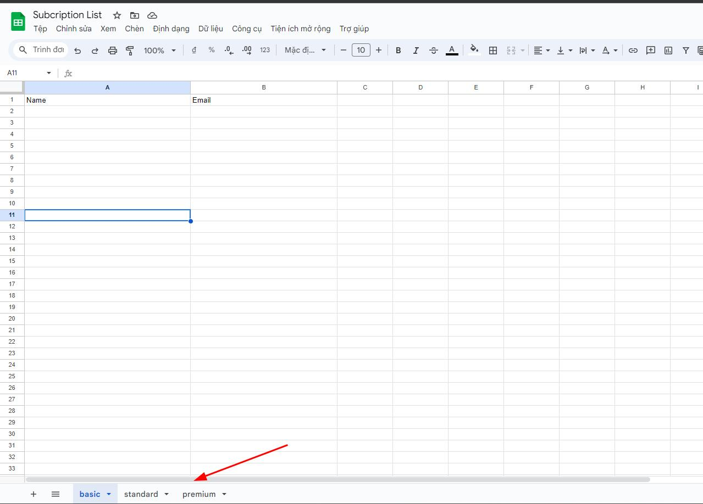
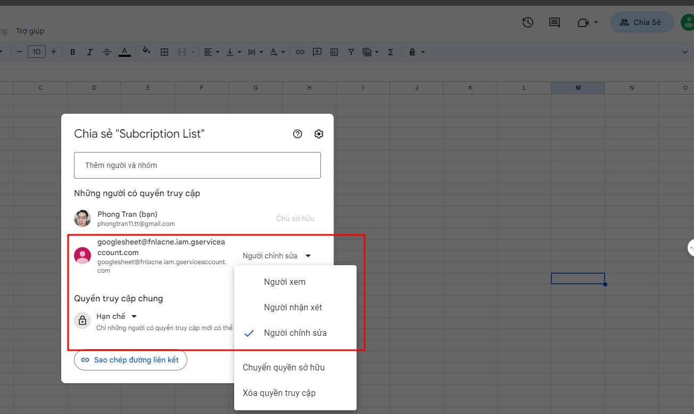

# FRAMEWORK & LIBRARY:

1. nextJS 14
2. daisyUI
3. redux hook form
4. zod
5. react toastify
6. google apis
7. tailwind css
8. hero icon
9. nodemailer

## SETUP

1. copy file credential google in to root folder
2. change duplicate .env: `cp .env.example .env`
3. create sheet doc on google doc. Make sure create 3 sheet: `basic` `standard` `premium`

4. provide service email `googlesheet@fnlacne.iam.gserviceaccount.com` with edit permission
   

## Run Project

4. yarn
5. yarn dev
